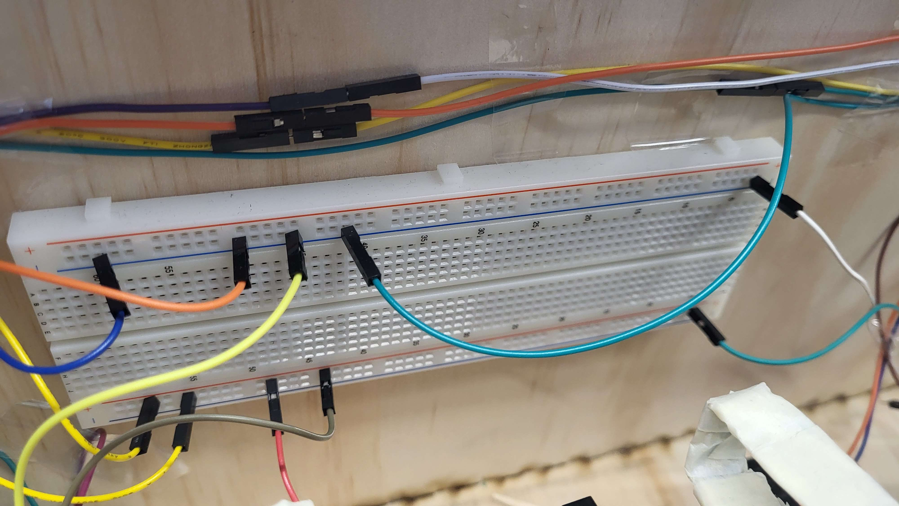

# DIY-Anleitung: Anzeigegerät für freie Lernräume

Unser Anzeigegerät bietet eine bequeme Möglichkeit, schnell einen Überblick über die aktuelle Raumsituation zu erlangen. Neben der Anzahl an anwesenden Personen, die relativ zu der Raumkapazität farblich bewertet wird, gibt es auch eine symbolische Kategorisierung von "Vorlesungen", "Klausuren" oder "Besser-nicht-stören".
Somit bietet sich der Einsatzbereich vor allem in Instituten des Bildungswesens an.

# Inhaltsverzeichnis

- [Einführung](#einführung)
- [Vorbereitung](#vorbereitung)
    - [Material](#material)
    - [Werkzeug](#werkzeug)
    - [Software](#software)
    - [Empfohlene Vorkenntnisse](#empfohlene-vorkenntnisse)
- [Bauanleitung](#bauanleitung)
- [Funktionsweise](#funktionsweise)
- [Ausblick](#ausblick)

# Einführung

Du bist StudentIn und hast keine Ahnung, wo ein ruhiger Raum zum Lernen ist? Die Bibliothek ist schon zu und der Aufenthaltsraum der Fakultät zu überfüllt? Dann bleibt nur noch eine Möglichkeit: Das aufwendige Suchen nach einem freien Vorlesungsraum, ohne dabei in belegte Räume zu platzen oder den längsten Treppen-Marathon bewältigen zu müssen.

Jetzt gibt es aber eine neue Möglichkeit: Einfach einen Blick auf das Anzeigegerät werfen und schon hat man einen Raum, der zu den eigenen Bedürfnissen passt.

Das Anzeigegerät wurde im Rahmen der Projektfrage "Wie können wir die Aufenthaltsqualität hier an der Hochschule Mannheim verbessern?"
Zu dieser Fragestellung haben wir ausführliche Interviews geführt und folgende Probleme festgestellt: Sowohl Studierenden als auch Angestellten und Lehrbeauftragten der Hochschule fehlt es an ruhigen Orten bzw. eher an Erreichbarkeit von ruhigen Orten. Die befragten Studierenden wünschen sich einen Ort, der ruhig genug zum Lernen ist, denn die Angebote der Hochschule selbst (Bibliothek, Denkräume, Aufenthaltsräume) sind zu überfüllt. Lehrbeauftragte suchen einen ruhigen Rückzugsort für die Pause oder Überbrückung bis zur Vorlesung. Ohne ein eigenes Büro ist dies aber schwer.

Aus den Interviews haben wir uns auf das Problem der Lernräume fokussiert, wobei die Persona "Emma Leblang" entstand. Emma ist 21 Jahre alt, wohnt in den Außenbezirken von Mannheim und studiert Informatik. Sie beschwert sich darüber, dass der Denkraum immer ziemlich voll ist und es wenige Sitzgelegenheiten gibt, die man alleine belegen kann. Wenn sie stattdessen in einem Vorlesungsraum lernen möchte, ist es sehr schwierig, einen leeren oder wenig besuchten Raum zu finden. 

Somit stellt sich die Frage: **Wie können wir Emma dabei helfen einen ruhigen Raum zu finden, um ungestörter Lernen zu können?**

Aktuell wird das Lernraum-Problem umgangen, indem die meisten Studierenden außerhalb der Hochschule lernen.

Unsere Idee des Anzeigegerätes soll zwei Kerneigenschaften vereinen:
Erstens soll zu dem angegebenen Raum die Anzahl anwesender Personen gemessen und angezeigt werden. In Relation zu der Raumkapazität wird die Zahl durch Ampelfarben bewertet - grün bedeutet, dass in dem Raum noch viele Plätze frei sind; gelb zeigt mäßig gefüllte Räume an; rot beschreibt eine fast vollständig genutzte Kapazität des Raumes und somit kein geeigneter Ort zum Lernen an.
Zweitens gibt es besondere Zustände eines Raumes, die die erste Anzeige unterstützen sollen. Wird in einem Raum eine Vorlesung gehalten, eine Klausur geschrieben oder ist stark gefüllt, wird ein entsprechendes Symbol angezeigt. Somit wird deutlich, dass ein Raum mit sechs Anwesenden, die allerdings eine Vorlesung besuchen, trotz grüner Zahl kein passender Ort zum Lernen ist.

Zusätzlich zu den oberen Funktionen ist die Raumnummer an der Anzeige austauschbar und bietet somit einen dynamischen Einsatz des Gerätes.

## Vorbereitung

Um das Anzeigegerät korrekt nachzubauen, werden folgende Materialien, Werkzeuge und Softwareausstattung benötigt. Zusätzlich empfehlen wir Vorkenntnisse in bestimmten Bereichen.

### Material

- 1x Holzplatte Kiefer (60cm x 140cm x 4mm)
- 1x Schaschlikspieß
- 2x Holzspatel (ggf. einer mehr)
- 1x Kaffeerührstäbchen
- 1x Aluminium Profil (Montageschiene, 59cm Länge)
- 5x kleine Schrauben
- 1x Holzblock (9cm x 5cm x 2cm)
- 1x Lochband aus Metall
- 1x DC Motor 3-12VDC
- 1x H-Brücke L298N
- 3x DEBO SEN HALL1 Lichtschranken 
- 2x Breadboard
- 1x Arduino Uno
- 1x Raspberry Pi 3B+
- 21 Jumperkabel (Unten 17, 4 Oben)
- 1x Netzteil mit DC Stecker
- 1x USB-Kabel A-B
- 1x WS2812B LED-Streifen (30 LEDs für 2 Siebensegmentanzeigen/Ziffern)
- isolierter Draht
- 1x Acrylglas (Größe: 25cm x 13cm)
- 1x Pappe (Größe: 15cm x 10cm)
- 1x HDMI-Kabel
- 2x USB-Kabel A-Micro
- 1x Pimoroni VL53L1X Time of Flight
- 1x WEMOS D1 Mini

### Werkzeug

- Stichsäge
- Lasercutter
- Sekundenkleber
- Doppelseitiges Klebeband
- Malerkrepp (Breite:19mm)
- Klebeband
- Schere
- Seitenschneider
- Spitzzange
- Lötkolben und Lötzinn
- Styroporkleber und Aktivator Spray
- Monitor
- Tastatur
- Maus
- (ggf.) Schleifpapier

### Software

Die benötigten Skripte befinden sich im folgendem Repository: [Evolition](https://github.com/cbm-instructions/evolition)

Zusätzlich sind dort unter SVG die entsprechenden Modelle für den Lasercutter zu finden.

### Empfohlene Vorkenntnisse

Wir empfehlen Erfahrungen im Umgang mit der Programmiersprache Python und der Arduino IDE (C).

Für die handwerklichten Schritte sind Erfahrungen mit dem Lasercutter, dem Lötkolben, der Stichsäge und der Bohrmaschine zu empfehlen.

# Bauanleitung

In dieser Bauanleitung wird beschrieben, wie das Anzeigegerät zusammengebaut wird.

## Schritt 1: Lasercutten der unteren Box

**Benötigte Materialien und Werkzeuge**:

- Holzplatte Kiefer
- Stichsäge
- Lasercutter
- SVG: Box_unten.svg

**Vorgehen**:

1. Schneiden Sie von der großen Holzplatte (Kiefer) eine Fläche von 60cm x 80cm. Nutzen Sie hierfür eine Stichsäge, um eine höhere Genauigkeit zu erlangen.

2. Benutzen Sie das Modell "Box_unten.svg", um die untere Box mit dem Lasercutter schneiden zu lassen.

**Hinweis:** Je nach verwendetem Lasercutter-Modell unterscheiden sich die Maße der Nutzfläche. Achten Sie auf diese und teilen Sie gegebenenfalls das Holz in mehrere Durchgänge im Lasercutter. Passend Sie dementsprechend die svg-Datei an!

3. Bauen Sie die Box zusammen.

## Schritt 2: Einbauen der Schiebevorrichtung

    
    

**Benötigte Materialien und Werkzeuge**:

- Holzplatte (Kiefer)
- Schaschlikspieß
- Holzspatel
- Kaffeerührstäbchen
- Aluminium Profil
- kleine Schrauben (2 Stück)
- Lasercutter
- Stichsäge
- Sekundenkleber
- SVG: Bilder_unten.svg

**Vorgehen**:

1. Schneiden Sie von der übrigen Holzplatte (Kiefer) eine Fläche von 40cm x 10cm. Nutzen Sie hierfür eine Stichsäge, um höhere Genauigkeit zu erlangen.

2. Benutzen Sie das Modell "Bilder_unten.svg", um die Bilder der unteren Anzeige zu schneiden.

3. Kleben Sie mit dem Sekundenkleber den Schaschlikspieß längs auf den Holzspatel und warten Sie, bis dieser getrocknet ist.

4. Keben Sie anschließend das Kaffeerührstäbchen auf den Schaschlikspieß. Der Holzspatel und das Kaffeerührstäbchen sollen parallel zueinander liegen.

5. Wenn der Kleber getrocknet ist, schieben Sie das Holzgerüst in das Aluminiumprofil. Hierbei soll der Holzspatel außerhalb an der Schiene bewegbar sein.

**Hinweis:** Überschüssiger Kleber verklemmt die Schiebevorrichtung. Entfernen Sie diesen und das Holzgerüst sollte ohne Verklemmungen in der Schiene hin- und hergeschoben werden können.

6. Nehmen Sie das Holzgerüst wieder heraus und kleben Sie es der Länge nach in die Mitte auf die Rückseite der gecutteten Bildplatte, wie auf dem Bild zu sehen ist.

7. Schieben Sie nun die Bildplatte auf das Aluminium Profil.

8. Positioniern Sie das Aluminium Profil in der Holzbox, sodass die Bilder beim Verschieben gut durch das Sichtfeld auf der Vorderseite erkennbar sind.

9. Schrauben Sie das Aluminium Profil von außen auf der entsprechenden Höhe fest.

## Schritt 3: Motor einbauen

**Benötigte Materialien und Werkzeuge**:

- Holzplatte (Kiefer)
- DC Motor 3-12VDC
- Holzblock
- metallisches Lochband
- kleine Schrauben (3 Stück)
- Lasercutter
- Sekundenkleber
- (ggf. Schleifpapier oder Holzspatel)
- SVG: Zahnrad.svg

**Vorgehen**:

1. Schneiden Sie mithilfe der Zahnrad.svg Datei, die Sie unter dem Ordner SVG-Modell finden werden, zwei Zahnräder der Größe 9 cm x 5 cm mit einem Lasercutter aus.

2. Kleben Sie die zwei Zahnräder mithilfe des Kundenklebers zusammen.

3. Kleben Sie das Zahnrad so an den Motor, dass dieser es drehen kann.

4. Halten Sie den Motor so an den Holzblock, dass sich das Zahnrad ungehindert drehen kann und testen Sie, ob es die Bilder gut verschieben kann.

5. Falls nein, könnten Sie Schleifpapier verwenden, um den Block kleiner zu machen oder Holzspatel, um den Motor höher zu legen.

6. Sobald der Motor die richtige Position hat, befestigen Sie ihn mithilfe des Lochbands und 3 Schrauben an dem Holzblock, wie auf dem Bild zu sehen ist.

## Schritt 4: Schaltplan der unteren Box

    
    
    
    
    
    

**Benötigte Materialien und Werkzeuge**:

- H-Brücke
- Lichtschranken
- Breadboard (1 Stück)
- Arduino Uno
- Holzspatel (1 Stück)
- Jumperkabel (17 Stück)
- Netzteil mit DC Anschluss
- USB-Kabel A-B
- Malerkrepp
- Doppelseitiges Klebeband
- Schere
- Seitenschneider
- Spitzzange

**Vorgehen**:

1. Positionieren Sie die H-Brücke, den Getriebemotor, das Breadboard und den Arduino Uno wie auf dem Bild zu sehen und kleben Sie diese dann mit doppelseitigem Klebeband fest.

    **Hinweis**: Bei den Lichschranken ist haben wir kleine Holzplättchen zwischen Lichschranke und der entsprechenden Stelle geklebt, um Unebenheiten der Verlötung für bessere Haftung auszugleichen.

2. Die nächsten Unterschritte müssen insgesamt 4 mal gemacht werden:

    -  Schneiden Sie mit dem Seitenschneider ein Stück des Lochbands ab, das 8 Löcher enthält. Es sollte etwa 12cm lang sein.

    - Knicken sie das Lochband mithilfe der Spitzzange L-förmig. Bei der längeren Seite wird das Ende U-förmig geknickt. In Schritt 3 sieht man hierzu die genaue Form auf dem Bild.

    - Wickeln Sie für eine höhere Sicherheit Malerkrepp um das Lochband und verhintern Sie scharfe Kanten. Achten Sie darauf, dass das Krepp dicht am Lochband liegt und keine Unebenheiten entstehen.

3. Bringen Sie die aus Schritt 2 veränderten metallischen Lochbänder so an die Bildplatte an, dass diesen den Sensor in der Mitte immer dann unterbrechen, wenn das entsprechende Bild mittig durch das Loch der vorderen Wand der unteren Holzbox zu sehen ist.

4. Verbinden Sie nun alle elektronischen Bauteile mit den Jumperkabeln entsprechend des Schaltplans.

5. Schließen Sie das USB-Kabel A-B sowie das Netzteil mit DC Anschluss an den Arduino Uno an und führen Sie die Kable durch die Deckelöffnung

## Schritt 5: Code des Arduino

**Benötigte Materialien und Werkzeuge**:

- [ArduinoUnoCode](https://github.com/cbm-instructions/evolition/tree/main/Software/ArduinoUno)

**Vorgehen**:

1. In der installation.md finden Sie eine Anleitung, wie Sie den Code auf den Arduino spielen können.

## Schritt 6: Lasercutten der oberen Box

**Benötigte Materialien und Werkzeuge**:

- Holzplatte (Kiefer)
- Lasercutter
- Stichsäge
- SVG: Box_oben.svg

**Vorgehen**:

1. Schneiden Sie die Kieferplatte mithilfe der Stichsäge auf eine Größe von 60 cm × 40 cm zu.

2. Verwenden Sie die Box_oben.svg-Datei, die Sie im Ordner SVG-Modelle finden werden, um sich von einem Lasercutter die Box auschneiden zu lassen.

3. Stecken Sie die Wände und den Boden der Box zusammen. Wir raten davon, den Deckel schon mit zusammenzustecken, da dieser danach nur noch schwer zu öffnen sein wird.

## Schritt 7: Zahlenanzeige löten

**Benötigte Materialien und Werkzeuge**:

- WS2812B LED-Streifen Band
- isolierter Draht
- Jumperkabel (4 Stück)
- Schere
- Lötkolben und Lötzinn

**Vorgehen**:

1. Schneiden WS2812B LED-Streifenband in 6 Streifen mit je 5 LEDs. Hierbei ist es wichtig zu beachten, dass an beiden Enden der Streifen genügend Kupferfläche erhalten bleibt.

2. Positionieren Sie die Streifen, so dass sich insbesondere Data out und Data in gegenüberliegen.

3. Schneiden Sie den isolierten Draht auf eine solche Länge, dass die Streifen parallel nebeneinander liegen können, wenn der Draht sie verbinden würde. Isolieren Sie die Drahtstücke an den jeweiligen Enden ab

4. Verbinden Sie nun die entsprechenden Kupferstellen der Streifen, indem Sie die Drahtstücke anlöten.

5. Löten Sie die Jumperkabel an die ersten Eingänge an.

## Schritt 8: Einbauen der Zahl in die Box

**Benötigte Materialien und Werkzeuge**:

- Arcylglas
- Pappe
- Lasercutter
- Klebeband
- Styroporkleber und Aktivatorspray
- SVG: Acrylglas.svg

**Vorgehen**:

1. Schneiden Sie das Acrylglas mit einem Lasercutter auf die Größe 25 cm x 13 cm. Hierfür können Sie die Acrylglass.svg Datei in dem Ordner SVG-Modelle verwenden.

2. Platzieren Sie die gelötete Anzeige auf einem Stück Pappe mit den Maßen 15 cm x 10 cm so, dass die Zahlen durch die Löcher zu sehen sind, wenn Sie die Pappe an die Boxwand mit den Löchern halten.

3. Wenn dem so ist, können Sie die Klebestreifen der Zahlenanzeige abziehen und diese auf die Pappe kleben
Hierbei ist es wichtig, darauf zu achten, dass die einzelnen LEDs möglichst parallel zueinander angebracht sind, damit die Zahlen nicht verruscht aussehen.

4. Kleben Sie als nächstes die Pappe mithilfe des doppelseitigen Klebebands so an die Innenseite der Holzbox, dass oben die Kabel der Zahleanzeige herausschauen und das Selbige gut durch die Löcher der Holzbox zu sehen ist.

5. Tragen Sie den Styroporkleber an den an der Vorderseite hervorstehenden Ecken der Holzbox auf. Dann sollten Sie möglichst schnell das Acrylglas auflegen und die Ecken mit dem Aktivatorspray besprühen, damit der Kleber möglichst schnell trocknet und sich nicht sicherbar unter dem Acrylglas verteilt.

## Schritt 9: Schaltplan der oberen Box

    
    
    

**Benötigte Materialien und Werkzeuge**:

- Raspberry Pi 3B+
- USB-Kabel A-B
- USB-Kabel A-Micro
- HDMI Kabel sowie Maus und Tastatur

**Vorgehen**:

1. Platzieren Sie den Raspberry Pi in der oberen Box.

2. Schließen Sie die vier Jumperkabel der Zahlenanzeige entsprechend wie im Bild oben zu sehen an den Raspberry Pi an.

3. Verbinden Sie den Raspberry Pi mit dem Arduino Uno aus der unteren Box mithilfe des USB-Kabels A-B, indem Sie das Kabel durch die entsprechenden Löcher im Boden der oberen Box und den Deckel der unteren Box führen.

4. Es empfiehlt sich, zur späteren Inbetriebnahme der Software für den Raspberry Pi, an diesen noch ein HDMI-Kabel sowie eine Maus und Tastatur anzuschließen und durch das Loch in der Rückwand der oberen Box hinaus zuzuführen.

5. Führen Sie ebenso das Stromkabel des Arduino Unos aus der unteren Box durch das Loch in der Rückwand der oberen Box hinaus.

6. Schließen Sie an Raspberry Pi das USB-Kabel A-Mikro an, um diesen später mit Strom versorgen zu können.

7. Schließen Sie den Deckel der oberen Box noch nicht, da dieser danach schwer zu entfernen ist und dies die spätere Trennung des Raspberry Pis, des HDMI-Kabels sowie der Maus und der Tastatur erschwert.

## Schritt 10: Schaltplan des ToF-Sensors

**Benötigte Materialien und Werkzeuge**:

- Breadboard
- Pimoroni VL53L1X Time of Flight
- WEMOS D1 Mini
- isolierter Draht
- Schere

**Vorgehen**:

1. Schneiden Sie den isolierten Draht in entsprechende Stücke, isolieren Sie jeweils beide Enden ab und stecken Sie die Drahtstücke, wie in dem Bild zu sehen, auf das Breadboard.

2. Stecken Sie den WEMOS D1 Mini und den Pimoroni VL53L1X Time of Flight an ihre in dem Bild zu sehenden Positionen. Hierbei gilt es zu beachten, dass der Sensor nach unten zeigt, wenn man das Breadboard längs aufstellt.

3. Auf dem Pimoroni VL53L1X Time of Flight befindet sich nach dem ersten Auspacken noch eine Schutzfolie, die Sie abziehen sollten.

## Schritt 11: Konfiguration des ToF-Sensors

**Benötigte Materialien und Werkzeuge**:

- [Weimos D1 Mini](https://github.com/cbm-instructions/evolition/tree/main/Software/WeimosD1Mini)

**Vorgehen**:

1. Wir haben folgendes Projekt für unsere Zwecke angepasst [DIY-Laser-People-Counter](https://www.instructables.com/DIY-Laser-People-Counter/)

2. In der installation.md erhalten Sie eine Anleitung, wie man den Sensor für die Anzeige konfiguriert.

## Schritt 12: Code des Raspberry Pi

**Benötigte Materialien und Werkzeuge**:

- [RaspberryPi](https://github.com/cbm-instructions/evolition/tree/main/Software/RaspberryPi)

**Vorgehen**:

1. In der installation.md finden Sie eine entsprechende Anleitung wie Sie den Code für den Raspberry Pi nutzen können

## Schritt 13: Raumnummer hinzufügen

    
    

**Benötigte Materialien und Werkzeuge**:

- Holzplatte (Kiefer)
- Lasercutter
- SVG: Raumnummer.svg

**Vorgehen**:

1. Schneiden Sie mithilfe des Models Raumnummer.svg, das Sie in dem Ordner SVG-Modelle finden werden und eine Größe von 15,5 cm x 9,5 cm haben wird, die in den Deckel rein steckbare Karte aus dem Rest der Holzplatte aus. Diese kann auf der Vorder- und Rückseite graviert werden. Dabei sollten Sie, wenn Sie die Anzeige für einen anderen Raum aufstellen wollen, die Gravur entsprechen, verändern.

2. Deckel der oberen Box schließen und die Karte einstecken.

# Funktionsweise

Der Time-of-Flight (ToF) wird normalerweise zur Messung der Entfernung zwischen einem Sensor und einem Objekt genutzt. Der ToF-Sensor sendet Lichtimpulse, welche im Infrarotbereich liegen, da menschliche Augen nicht empfindlich für Infrarotlicht sind.
Anschließend wird berechnet, wie lange das Licht benötigt, vom Sensor zum Objekt und anschließend wieder zum Sensor zu gelangen. Der Sensor kann so berechnen, wie groß die Entfernung zu einem Objekt ist.
Hier wird der ToF-Sensor eingesetzt, um zu erkennen, wann eine Person durch die Tür läuft. Die Entfernung zu einer Person ist geringer als zum Boden, wodurch der Sensor zwischen Person und regulärem Abstand zum Boden unterscheiden kann.
Um zu erkennen, ob eine Person in den Raum ein- oder austritt, wird der Bereich, den der Sensor erkennen kann, in 2 verschiedene Bereiche aufgeteilt. Anhand dessen, welcher Bereich zuerst betreten wird, kann bestimmt werden, aus welcher Richtung die Person kommt.

Die Zahl, die die obere Box anzeigt, ist die entsprechende Personenanzahl im Raum, die mithilfe des ToF-Sensors ermittelt wurd. 
Sollte diese Zahl maximal ein Drittel der eingestellten maximalen Sitzplatzanzahl sein, so leuchtet diese grün. Im nächsten Drittel wird sie gelb und im letzten Drittel wird sie rot.
Gleichzeitig hat die Anzeige die Vorlesungs- und Klausurenpläne und wird während der entsprechenden Uhrzeit für den entsprechenden Raum in der unteren Box ein Bild zeigen, das den entsprechenden Status  symbolisiert. Dabei kann auch der Status Nichts angezeigt werden, sollte kein anderer Status gerade zutreffen.
Sollte die Anzeige der Personenanzahl rot werden, so wird in der unteren Box mit einem Bild, das Gandalf darstellen soll, humoristisch davor gewarnt, in diesem Raum zu lernen.

# Ausblick

In der Zukunft können wir uns vorstellen, dass man zur einfacheren Wartung der oberen Box einen anderen Verschließmeachnismus bauen sollte. Außerdem könnte man gebuchte Räume einbeziehen, wenn man Zugang zu einem entsprechenden System hätte.
Um den Sensor vor Erschütterung und Dreck etc. zu schützen wäre es gut, wenn man diesem noch ein Gehäuse baut oder 3D-Druckt. Ebenso könnte man die PeopleCounterFirmware so anpassen, dass der Weimos D1 Mini, die Sensordaten direkt per MQTT an den Raspberry Pi schickt, anstatt es über eine Webpage abzufragen.
